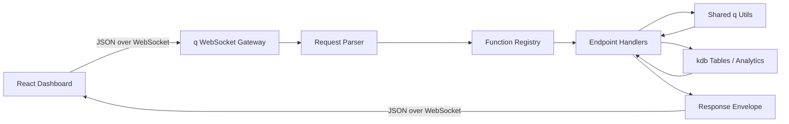

# kdb-dashboard-library

`kdb-dashboard-library` is an open-source-ready starter kit for teams that want a practical bridge between `kdb+/q` and `React`.

The goal is simple:

- keep the backend in pure `q`
- expose dashboard-friendly functions over WebSocket
- make frontend consumption predictable with JSON request/response contracts
- give teams a clean place to keep adding new business endpoints without rebuilding the plumbing every time

This repository is designed for finance users who already know `kdb` and want a smoother path to interactive dashboards, internal tools, and market-data workflows in React.

## Why This Exists

Most `kdb` stacks are strong on analytics but light on frontend integration patterns. This starter kit is meant to provide:

- a `q` backend that receives JSON messages, routes them to the correct handler, and sends JSON responses back
- a React frontend with a reusable WebSocket client, request lifecycle handling, and finance-friendly dashboard building blocks
- a clean extension pattern for adding new endpoints under `backend/` without turning the codebase into a single giant `q` file
- a familiar visual baseline inspired by terminal-style finance products, with room to evolve into richer dashboards

## What The Starter Kit Covers

### Backend

- Native `q` WebSocket handling
- A transport flow that fits normal q handle usage such as `.z.ws`, `neg`, and `hopen`-style connectivity patterns
- JSON request parsing and validation
- Function registry / dispatch layer
- Reusable parsing and serialization helpers
- Consistent response and error envelopes
- A straightforward folder convention for adding new endpoint functions

### Frontend

- Shared WebSocket connection management
- Request/response synchronization with React state
- A dashboard composition pattern for tables, time series, bar charts, KPI cards, and rankings
- A finance-oriented visual system with dark surfaces, high-contrast typography, and terminal-inspired accent colors

## Architecture At A Glance



Message flow:

1. The React client sends a JSON request containing `requestId`, `func`, and `params`.
2. The `q` gateway parses the payload and resolves `func` through a registry.
3. The matched endpoint handler runs business logic, usually against kdb tables or analytics functions.
4. The backend returns a normalized JSON response with either `status: "ok"` or `status: "error"`.
5. The frontend updates local state and renders tables, charts, or summary widgets.

More detail lives in [docs/architecture.md](docs/architecture.md).

## Suggested Repository Layout

The repository assumes backend and frontend code will live in these top-level directories:

```text
kdb-dashboard-library/
├── backend/
│   ├── main.q
│   ├── config/
│   ├── router/
│   ├── endpoints/
│   ├── utils/
│   └── tests/
├── frontend/
│   ├── package.json
│   ├── src/
│   │   ├── app/
│   │   ├── components/
│   │   ├── features/
│   │   ├── hooks/
│   │   ├── services/
│   │   ├── theme/
│   │   └── utils/
│   └── public/
├── docs/
├── .github/
├── CONTRIBUTING.md
└── README.md
```

This keeps the transport layer, endpoint logic, shared `q` utilities, and React UI concerns clearly separated.

## JSON Request / Response Contract

The default contract should stay intentionally small and predictable.

### Request

```json
{
  "requestId": "req-20260503-001",
  "func": "getTopMovers",
  "params": {
    "date": "2026-05-03",
    "limit": 10,
    "universe": "EQUITIES_US"
  },
  "meta": {
    "source": "dashboard",
    "clientVersion": "0.1.0"
  }
}
```

### Success Response

```json
{
  "requestId": "req-20260503-001",
  "status": "ok",
  "func": "getTopMovers",
  "data": {
    "rows": [
      { "sym": "AAPL", "movePct": 1.82, "volume": 50213421 },
      { "sym": "MSFT", "movePct": 1.37, "volume": 29011420 }
    ],
    "asOf": "2026-05-03T09:30:00.000Z"
  },
  "error": null
}
```

### Error Response

```json
{
  "requestId": "req-20260503-001",
  "status": "error",
  "func": "getTopMovers",
  "data": null,
  "error": {
    "code": "UNKNOWN_FUNCTION",
    "message": "No endpoint registered for getTopMovers",
    "details": {
      "availableFunctions": ["healthCheck", "getTrades", "getPnLSeries"]
    }
  }
}
```

Additional contract examples live in [docs/request-response-contracts.md](docs/request-response-contracts.md).

## Endpoint Extension Pattern

The core design principle is that adding a new dashboard capability should mostly mean adding one new endpoint file and registering it.

Recommended pattern:

1. Create a new handler file under `backend/endpoints/`.
2. Expose a single public function that accepts parsed `params`.
3. Register the function name in the backend registry.
4. Reuse shared parsing / coercion helpers from `backend/utils/`.
5. Return a normalized result that the WebSocket gateway can serialize consistently.

Example:

```q
/ backend/endpoints/top_movers.q
.api.getTopMovers:{
  params:x;
  limit:$[null~params`limit;10;params`limit];
  dt:$[null~params`date;.z.D;params`date];

  rows:select sym, movePct, volume from .data.topMovers where date=dt;
  `rows`asOf!(limit#rows;.z.P)
 }
```

```q
/ backend/router/registry.q
.router.handlers:`healthCheck`getTopMovers`getPnLSeries!
  (.api.healthCheck;.api.getTopMovers;.api.getPnLSeries)
```

Full guidance is in [docs/endpoint-pattern.md](docs/endpoint-pattern.md).

## Local Development Workflow

Once backend and frontend scaffolds are added, the expected workflow is:

1. Start the `q` WebSocket server from `backend/`.
2. Start the React app from `frontend/`.
3. Open the dashboard and verify WebSocket connectivity.
4. Add new backend endpoints under `backend/endpoints/`.
5. Add matching frontend request wrappers and visual components.

See [docs/getting-started.md](docs/getting-started.md) for the intended setup flow and operational notes.

## Documentation Map

- [Architecture](docs/architecture.md)
- [Getting Started](docs/getting-started.md)
- [Endpoint Extension Pattern](docs/endpoint-pattern.md)
- [Request / Response Contracts](docs/request-response-contracts.md)
- [Roadmap](docs/roadmap.md)
- [Contributing](CONTRIBUTING.md)

## Roadmap

Near-term priorities:

- scaffold the pure `q` WebSocket gateway
- scaffold the React client and finance-focused theme
- provide a small reference endpoint set such as health check, top movers, trade blotter, and PnL time series
- add request validation, connection lifecycle handling, and smoke tests
- document deployment patterns for internal desks and open-source adopters

See the fuller plan in [docs/roadmap.md](docs/roadmap.md).

## Intended Users

This starter kit is especially useful for:

- market data and trading teams with an existing `kdb` estate
- internal dashboard builders who want React without introducing a heavy non-`q` backend
- teams open-sourcing or standardizing a reusable `kdb` dashboard baseline

## Contribution Philosophy

The project should stay approachable:

- easy to extend with one more endpoint
- easy to reason about in both `q` and React
- easy to onboard for teammates who know finance better than frontend infrastructure

If you want to help shape that direction, start with [CONTRIBUTING.md](CONTRIBUTING.md).
