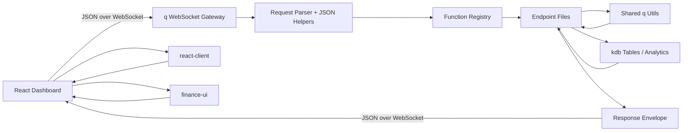

# kdb-dashboard-library

`kdb-dashboard-library` is a private-first, open-source-ready starter kit for teams that want a practical bridge between `kdb+/q` and React dashboards.

The repo is built around a simple idea:

- keep the backend in pure `q`
- expose dashboard-friendly functions over WebSocket
- keep the frontend contract boring and predictable
- give users a clean place to keep adding new endpoints without rebuilding the plumbing every time

## What Is In The Repo

The monorepo is split into runnable apps plus reusable frontend packages:

- `apps/q-gateway`: pure `q` websocket service, routing, reusable helpers, sample endpoints
- `apps/dashboard`: Vite + React dashboard app that talks to the gateway over WebSocket
- `packages/protocol`: shared TypeScript request/response types and demo fixtures
- `packages/react-client`: reusable React connection layer and request hooks
- `packages/finance-ui`: Bloomberg-inspired theme and finance-focused visualization components

## Architecture At A Glance



## Repository Layout

```text
kdb-dashboard-library/
├── apps/
│   ├── dashboard/
│   └── q-gateway/
├── packages/
│   ├── finance-ui/
│   ├── protocol/
│   └── react-client/
├── docs/
├── .github/
├── CONTRIBUTING.md
├── LICENSE
└── README.md
```

## Quick Start

### 1. Install frontend dependencies

```bash
pnpm install
```

### 2. Start the q gateway

`q` is not bundled with this repository, so install kdb+/q separately.

The gateway startup script will try the following automatically:

- `Q_BIN`
- `q` on your `PATH`
- `~/.kx/bin/q` for KDB-X Community Edition
- `~/q/m64/q`
- `~/q/l64/q`

If you want to point at a specific binary, override it inline:

```bash
Q_BIN=/absolute/path/to/q pnpm dev:gateway
```

If startup fails, inspect the detected binary and license state with:

```bash
pnpm q:doctor
```

```bash
pnpm dev:gateway
```

By default the gateway listens on `ws://localhost:5050`.

### 3. Start the dashboard

```bash
pnpm dev:dashboard
```

If you want a different gateway URL, copy [`apps/dashboard/.env.example`](apps/dashboard/.env.example) to `apps/dashboard/.env` and override `VITE_KDB_WS_URL`.

## JSON Request / Response Contract

The starter contract is intentionally small and predictable.

### Request

```json
{
  "id": "req-20260503-001",
  "func": "dashboard.snapshot",
  "params": {
    "book": "macro"
  }
}
```

### Success Response

```json
{
  "id": "req-20260503-001",
  "ok": true,
  "func": "dashboard.snapshot",
  "data": {
    "overview": [],
    "allocation": [],
    "priceSeries": [],
    "volumeSeries": [],
    "movers": []
  },
  "server": "kdb-dashboard-library",
  "ts": "2026.05.03D01:58:00.000000000"
}
```

### Error Response

```json
{
  "id": "req-20260503-001",
  "ok": false,
  "func": "dashboard.snapshot",
  "error": {
    "code": "unknownFunction",
    "message": "No endpoint is registered for the requested func",
    "details": {}
  },
  "server": "kdb-dashboard-library",
  "ts": "2026.05.03D01:58:00.000000000"
}
```

More detail lives in [docs/request-response-contracts.md](docs/request-response-contracts.md).

## Endpoint Extension Pattern

Adding a new dashboard capability should mostly mean adding one new endpoint file and registering it.

Recommended pattern in `apps/q-gateway/src/endpoints/`:

1. Create a new `.q` file under `apps/q-gateway/src/endpoints/`.
2. Expose a single handler that accepts parsed `params`.
3. Register the function through `.kdb.registry.register`.
4. Reuse shared helpers from `apps/q-gateway/src/utils/`.
5. Return a q dictionary or table that `.j.j` can serialize cleanly.

Example:

```q
.kdb.registry.register[
  `trade.snapshot;
  {[params]
    symbol:.kdb.util.getOr[params; `symbol; "AAPL"];
    `symbol`price`timestamp!(
      symbol;
      194.22;
      string .z.p
    )
  };
  `name`description`group!(
    "trade.snapshot";
    "Returns a single-instrument snapshot payload.";
    "dashboard"
  )
];
```

Full guidance is in [docs/endpoint-pattern.md](docs/endpoint-pattern.md).

## Why The UI Feels Familiar To Finance Users

The default dashboard theme leans into:

- dense information layout
- charcoal surfaces
- amber, green, and red signal colors
- monospaced numeric emphasis
- reusable finance-focused charts and tables

It is inspired by tools finance users already feel comfortable with, while staying fully editable in normal React/CSS.

## Best First Use Case

The best first deployment for this starter is an **intraday trading desk risk cockpit**:

- top-line KPIs for PnL, gross, net, VaR, and utilization
- ranked movers and contributors
- time-series panels for intraday drift
- one or two drill-down endpoints for desk-specific workflows

That use case fits the repo especially well because it maps directly to:

- `q` for shaping exposures, rankings, and time series
- WebSocket requests for fast dashboard refreshes
- the included finance-oriented React component set

See [docs/use-cases.md](docs/use-cases.md) for the flagship workflow plus more sample patterns.

## Documentation Map

- [Architecture](docs/architecture.md)
- [Backend Architecture](docs/backend/architecture.md)
- [Adding Backend Endpoints](docs/backend/adding-endpoints.md)
- [Dashboard Notes](docs/frontend/README.md)
- [Getting Started](docs/getting-started.md)
- [Use Cases](docs/use-cases.md)
- [Endpoint Extension Pattern](docs/endpoint-pattern.md)
- [Request / Response Contracts](docs/request-response-contracts.md)
- [Roadmap](docs/roadmap.md)
- [Contributing](CONTRIBUTING.md)

## Intended Users

- market data and trading teams with an existing `kdb` estate
- internal dashboard builders who want React without introducing a heavy non-`q` backend
- teams open-sourcing or standardizing a reusable `kdb` dashboard baseline

If you want to help shape that direction, start with [CONTRIBUTING.md](CONTRIBUTING.md).
