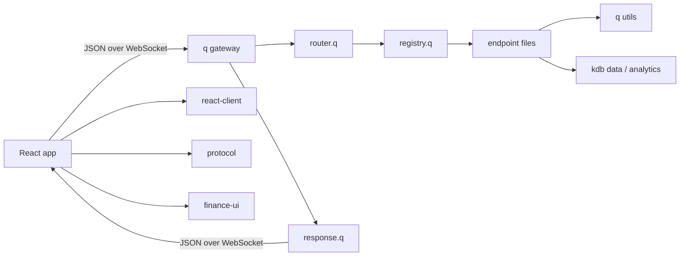

# kdb-dashboard-library

Utilities for building React dashboards on top of `kdb+/q`.

This repo contains:

- a q websocket gateway for JSON request and response routing
- an endpoint registration pattern under `apps/q-gateway/src/endpoints`
- shared TypeScript protocol types in `packages/protocol`
- a React connection layer and hooks in `packages/react-client`
- dashboard components and theme styles in `packages/finance-ui`
- an example dashboard app and a deployable static docs site

## Repository Layout

```text
kdb-dashboard-library/
├── apps/
│   ├── docs-site/
│   ├── dashboard/
│   └── q-gateway/
├── packages/
│   ├── finance-ui/
│   ├── protocol/
│   └── react-client/
├── docs/
├── .github/
├── CONTRIBUTING.md
├── LICENSE
└── README.md
```

## Runtime Layout



## Quick Start

### 1. Install workspace dependencies

```bash
pnpm install
```

### 2. Start the q gateway

The gateway startup script looks for `q` in this order:

- `Q_BIN`
- `q` on `PATH`
- `~/.kx/bin/q`
- `~/q/m64/q`
- `~/q/l64/q`

If you need to point to a specific binary:

```bash
Q_BIN=/absolute/path/to/q pnpm dev:gateway
```

If startup fails, inspect the detected runtime and license:

```bash
pnpm q:doctor
```

Run the gateway:

```bash
pnpm dev:gateway
```

Default websocket URL: `ws://localhost:5050`

### 3. Start the dashboard

```bash
pnpm dev:dashboard
```

If you want a different gateway URL, copy [`apps/dashboard/.env.example`](apps/dashboard/.env.example) to `apps/dashboard/.env` and set `VITE_KDB_WS_URL`.

### 4. Start the docs site

```bash
pnpm dev:docs
```

Build the static docs output:

```bash
pnpm build:docs
```

## Core Runtime Surfaces

### q gateway

- `apps/q-gateway/src/main.q`: process entry point
- `apps/q-gateway/src/load.q`: shared loader for utils and core modules
- `apps/q-gateway/src/core/bootstrap.q`: startup flow and port binding
- `apps/q-gateway/src/core/router.q`: request parsing and dispatch
- `apps/q-gateway/src/core/ws.q`: websocket callbacks and transport
- `apps/q-gateway/src/core/stream.q`: sample pushed stream support

### Frontend packages

- `packages/react-client`: websocket client, provider, and hooks
- `packages/protocol`: shared request and response types
- `packages/finance-ui`: reusable dashboard components and theme styles
- `apps/dashboard`: example React dashboard that consumes the gateway

## Request / Response Contract

### Request

```json
{
  "id": "req-20260503-001",
  "func": "dashboard.snapshot",
  "params": {
    "book": "macro"
  }
}
```

### Success response

```json
{
  "id": "req-20260503-001",
  "ok": true,
  "func": "dashboard.snapshot",
  "data": {
    "overview": [],
    "allocation": [],
    "priceSeries": [],
    "volumeSeries": [],
    "movers": []
  },
  "server": "kdb-dashboard-library",
  "ts": "2026.05.03D01:58:00.000000000"
}
```

### Error response

```json
{
  "id": "req-20260503-001",
  "ok": false,
  "func": "dashboard.snapshot",
  "error": {
    "code": "unknownFunction",
    "message": "No endpoint is registered for the requested func",
    "details": {}
  },
  "server": "kdb-dashboard-library",
  "ts": "2026.05.03D01:58:00.000000000"
}
```

More detail lives in [docs/request-response-contracts.md](docs/request-response-contracts.md).

## Add A Backend Endpoint

Create a `.q` file under `apps/q-gateway/src/endpoints/` and register one public function name.

Example:

```q
.kdb.registry.register[
  `trade.snapshot;
  {[params]
    symbol:.kdb.util.getOr[params; `symbol; "AAPL"];
    `symbol`price`timestamp!(
      symbol;
      194.22;
      string .z.p
    )
  };
  `name`description`group!(
    "trade.snapshot";
    "Returns a single-instrument snapshot payload.";
    "dashboard"
  )
];
```

Useful helpers:

- `.kdb.util.getOr` for optional params
- `.kdb.response.ok` and `.kdb.response.fail` for standardized envelopes
- `.kdb.registry.register` for public endpoint registration

Full guidance is in [docs/backend/adding-endpoints.md](docs/backend/adding-endpoints.md) and [docs/endpoint-pattern.md](docs/endpoint-pattern.md).

## Consume An Endpoint In React

```tsx
const { status } = useKdbConnection()

const snapshot = useKdbLiveQuery(
  'trade.snapshot',
  { symbol: 'AAPL' },
  { enabled: status === 'open' },
)
```

Main hooks:

- `useKdbConnection` for connection state and direct client access
- `useKdbRequest` for explicit request/response flows
- `useKdbLiveQuery` for query-style components
- `useKdbStream` for pushed stream updates

## Common Commands

```bash
pnpm dev:gateway
pnpm dev:dashboard
pnpm dev:docs
pnpm q:doctor
pnpm test:q
pnpm build:docs
```

If the docs site is deployed under a repo subpath, build with:

```bash
DOCS_BASE_PATH=/kdb-dashboard-library/ pnpm build:docs
```

## Documentation Map

- [Architecture](docs/architecture.md)
- [Backend Architecture](docs/backend/architecture.md)
- [Adding Backend Endpoints](docs/backend/adding-endpoints.md)
- [Dashboard Notes](docs/frontend/README.md)
- [Getting Started](docs/getting-started.md)
- [Static Docs App](apps/docs-site/README.md)
- [Use Cases](docs/use-cases.md)
- [Request / Response Contracts](docs/request-response-contracts.md)
- [Roadmap](docs/roadmap.md)
- [Contributing](CONTRIBUTING.md)
