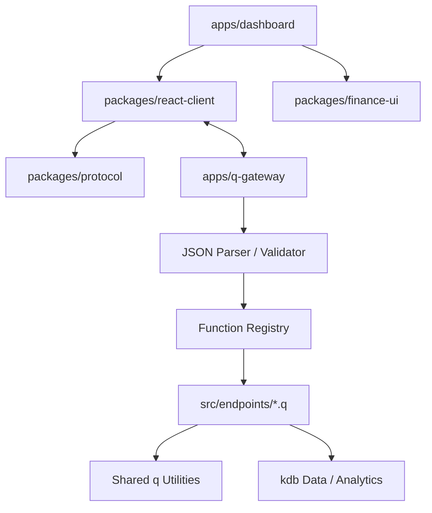
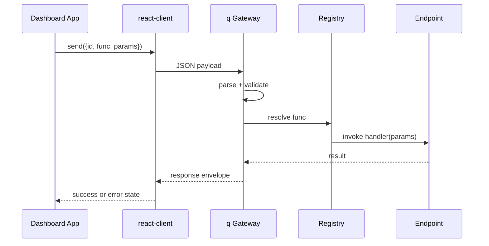

# Architecture

This document describes the architecture for `kdb-dashboard-library`: a pure `q` gateway connected to a React dashboard through a stable JSON-over-WebSocket contract.

## Design Goals

- Keep business logic in `q`
- Keep transport simple and explicit
- Make endpoint extension low-friction
- Normalize request and response shapes
- Support dashboard use cases common in finance: blotters, rankings, time series, KPIs, and drill-down panels
- Separate reusable frontend primitives from the sample app so the repo can grow into a library

## High-Level Topology



## Backend Responsibilities

### 1. WebSocket Gateway

Primary responsibilities:

- receive raw payloads from the frontend
- use q connection handles and the normal `.z.ws` / `neg` reply flow
- parse JSON into q data structures
- extract `id`, `func`, and `params`
- dispatch work through a registry rather than dynamic `value` on arbitrary input
- wrap handler results into a normalized response envelope
- send JSON back over the same socket

Keep the gateway small. It should focus on transport, not business logic.

### 2. Function Registry

The registry maps a public API function name to an actual q handler.

Endpoint files self-register through `.kdb.registry.register`, which keeps the startup path simple and makes supported functions explicit.

### 3. Endpoint Handlers

Endpoint handlers should:

- accept parsed parameters
- call domain logic or kdb tables
- shape output for dashboard consumption
- return plain q structures that can be serialized consistently

They should not need to know how the socket works.

### 4. Shared Utilities

Shared utility code should handle repetitive work such as:

- `.j.k` and `.j.j` wrapper behavior where shared parsing helpers make sense
- symbol / date / timestamp coercion
- defaulting nullable parameters
- response envelope construction
- standardized error objects

## Frontend Responsibilities

### 1. Shared React Client

The reusable client layer is responsible for:

- opening the connection
- reconnecting when appropriate
- sending serialized requests
- matching responses back to request IDs
- exposing connection state for UI feedback

### 2. Request State Management

React code should separate connection logic from visualization.

Suggested responsibilities:

- pending / success / error state
- caching or last-response state where useful
- request helpers such as `request("dashboard.snapshot", params)`

### 3. Finance UI Package

The reusable UI package currently provides:

- shell and panel primitives
- KPI card layouts
- price, volume, allocation, and movers visualizations
- Bloomberg-inspired theme tokens and typography

### 4. Dashboard App

The dashboard app demonstrates how the shared transport and UI layers fit together.

The default visual direction should feel finance-friendly:

- charcoal or near-black background surfaces
- amber, green, red, and cyan highlights
- compact spacing
- highly legible monospaced or terminal-adjacent typography for dense numeric views

## Message Lifecycle



## Repository Layout

```text
apps/
├── q-gateway/
│   ├── src/
│   │   ├── core/
│   │   ├── endpoints/
│   │   └── utils/
│   └── tests/
├── dashboard/
│   └── src/
packages/
├── protocol/
├── react-client/
└── finance-ui/
```

## Design Principles For Extensions

- Adding a new endpoint should not require editing the transport logic beyond registry wiring.
- JSON contracts should stay boring and stable.
- Frontend components should be usable with either live or demo data.
- Shared utilities should absorb repetitive parsing work rather than duplicating it across endpoints.

## Operational Considerations

As the implementation matures, expect to add:

- authentication and permissioning
- richer streaming or subscription envelopes
- additional q-side smoke coverage with a real runtime
- structured logging
- release packaging for shared frontend libraries

## Related Docs

- [Backend Architecture](backend/architecture.md)
- [Adding Backend Endpoints](backend/adding-endpoints.md)
- [Getting Started](getting-started.md)
- [Use Cases](use-cases.md)
- [Endpoint Pattern](endpoint-pattern.md)
- [Request / Response Contracts](request-response-contracts.md)
