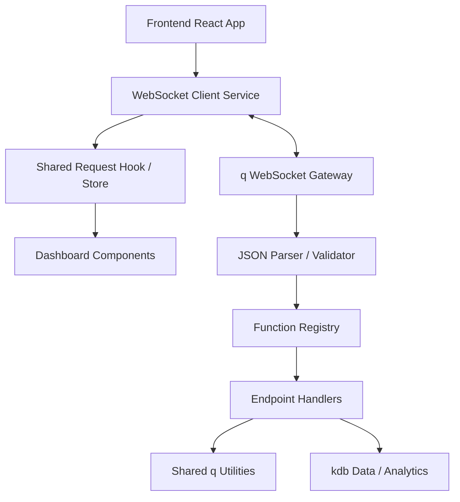
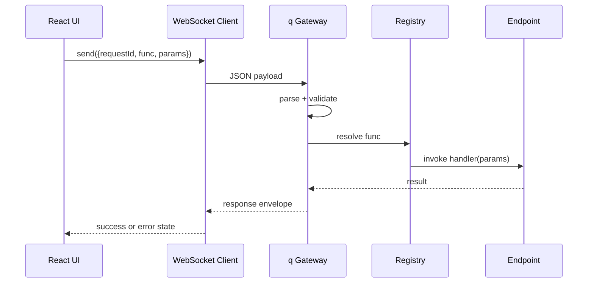

# Architecture

This document describes the intended architecture for `kdb-dashboard-library`: a pure `q` backend connected to a React dashboard through a stable JSON-over-WebSocket contract.

## Design Goals

- Keep business logic in `q`
- Keep transport simple and explicit
- Make endpoint extension low-friction
- Normalize request and response shapes
- Support dashboard use cases common in finance: blotters, rankings, time series, KPIs, and drill-down panels

## High-Level Topology



## Backend Responsibilities

The backend should stay deliberately layered.

### 1. WebSocket Gateway

Primary responsibilities:

- receive raw payloads from the frontend
- use q connection handles and the normal `.z.ws` / `neg` reply flow
- parse JSON into q data structures
- extract `requestId`, `func`, `params`, and optional `meta`
- dispatch work through a registry rather than dynamic `value` on arbitrary input
- wrap handler results into a normalized response envelope
- send JSON back over the same socket

Keep the gateway small. It should focus on transport, not business logic.

### 2. Function Registry

The registry maps a public API function name to an actual q handler.

Example direction:

```q
.router.handlers:`healthCheck`getTrades`getTopMovers`getPnLSeries!
  (.api.healthCheck;.api.getTrades;.api.getTopMovers;.api.getPnLSeries)
```

This is preferable to evaluating unchecked strings because it makes:

- supported endpoints explicit
- error handling cleaner
- future auth and permission checks easier

### 3. Endpoint Handlers

Endpoint handlers should:

- accept parsed parameters
- call domain logic or kdb tables
- shape output for dashboard consumption
- return plain q structures that can be serialized consistently

They should not need to know how the socket works.

### 4. Shared Utilities

Shared utility code should handle repetitive work such as:

- JSON-safe data shaping
- `.j.k` and `.j.j` wrapper behavior where shared parsing helpers make sense
- symbol / date / timestamp coercion
- defaulting nullable parameters
- table-to-dictionary conversion
- response envelope construction
- standardized error objects

This makes new endpoints faster to write and easier to keep consistent.

## Frontend Responsibilities

### 1. WebSocket Client

The frontend should have one shared client layer responsible for:

- opening the connection
- reconnecting when appropriate
- sending serialized requests
- matching responses back to request IDs
- exposing connection state for UI feedback

### 2. Request State Management

React code should separate connection logic from visualization.

Suggested responsibilities:

- pending / success / error state
- caching or last-response state where useful
- request helpers such as `callKdb("getTopMovers", params)`

### 3. Dashboard Components

Components should focus on rendering rather than transport.

Typical finance-oriented primitives:

- KPI tiles
- blotter / table grids
- ranked lists
- intraday or historical line charts
- grouped bar charts
- heatmaps

### 4. Theme System

The frontend visual system should default to a finance-friendly feel:

- charcoal or near-black background surfaces
- amber, green, red, and cyan highlights
- compact spacing
- highly legible monospaced or terminal-adjacent typography for dense numeric views

The result should feel familiar to users coming from terminal-style workflows without copying any proprietary product exactly.

## Message Lifecycle



## Suggested Backend Layout

```text
backend/
├── main.q
├── config/
│   └── app-config.q
├── router/
│   ├── websocket.q
│   ├── dispatcher.q
│   └── registry.q
├── endpoints/
│   ├── health_check.q
│   ├── top_movers.q
│   ├── trades.q
│   └── pnl_series.q
├── utils/
│   ├── parse.q
│   ├── response.q
│   ├── types.q
│   └── tables.q
└── tests/
```

## Suggested Frontend Layout

```text
frontend/
├── src/
│   ├── app/
│   ├── components/
│   ├── features/
│   ├── hooks/
│   ├── services/
│   │   └── kdbClient.ts
│   ├── theme/
│   └── utils/
└── public/
```

## Design Principles For Extensions

- Adding a new endpoint should not require editing the transport logic beyond registry wiring.
- JSON contracts should stay boring and stable.
- Frontend components should be usable with either live or mocked data.
- Shared utilities should absorb repetitive parsing work rather than duplicating it across endpoints.

## Operational Considerations

As the implementation matures, expect to add:

- authentication and permissioning
- heartbeat / reconnect handling
- request timeout strategy
- structured logging
- subscription-style pushes for live updates
- test fixtures for request and response payloads

## Related Docs

- [Getting Started](getting-started.md)
- [Endpoint Pattern](endpoint-pattern.md)
- [Request / Response Contracts](request-response-contracts.md)
